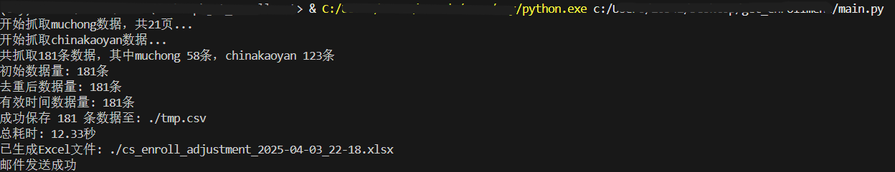

本仓库基于以下两个信源：[小木虫](https://muchong.com/bbs/kaoyan.php?action=adjust&type=1&page=1)和[中国考研网](https://www.chinakaoyan.com/tiaoji/schoollist/pagenum/1.shtml)获取数据，其中，对于小木虫内信息的获取方式参考[ChemLez](https://github.com/ChemLez/xmcTiaoJiInformation_Pachong)的写法，欢迎在现有基础上继续优化代码。运行时只需调整`main.py`中的参数，其中`post_service.py`主要用于向指定邮箱发送新生成的数据，这主要是为了满足我个人的使用需求，单独使用时可以不用。

使用例：

